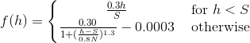

Bitcoin-NG for Aeternity
==========

Bitcoin-NG is an evolution of the Bitcoin protocol [1]. It still uses Nakamoto consensus but separates leader election and block production. This separation is done by introducing two kinds of blocks, key and micro. Key blocks are used for leader election. They don't contain any transactions but do require a solution to a Proof of Work puzzle. Once a leader has been found, they can produce multiple micro blocks. Micro blocks include transactions but do not require solutions to Proof of Work puzzles. Instead they need to be cryptographically signed be the current leader to be considered valid.

Splitting up leader election and block production allows a leader to produce micro blocks in rapid succession, increasing the transaction throughput significantly.


Low level view of Bitcoin-NG
===
For a miner to become the leader for an epoch, they have to produce a Key block containing a valid Proof of Work solution and a public key to which they have the corresponding private key.
Once they have produced such a block, they can start issuing Micro blocks. These Micro blocks do not require any Proof of Work puzzle solutions but must be signed by the private key belonging to the public key included in the Key block.

      ┌────────┐                        ┌────────┐
      │   1    │   ┌─────┐   ┌─────┐    │   2    │  ┌─────┐
      │  KB-1  │───│MB(1)│───│MB(1)│────│  KB-2  ├──│MB(2)│
      │        │   └─────┘   └─────┘    │        │  └─────┘
      └────────┘                        └────────┘


      KB1: Key Block with Pub Key 1 belonging to Leader 1
      MB(1): Micro Block signed by Leader 1 with Priv Key 1
      1: Height of the chain at Key Block 1

      Description:
      Leader 1 broadcasted two Micro Blocks. Leader 2 send out new Key Block holding his key.
      Leader 2 emitted one Micro Block so far


Leaders, who follow the protocol, emit Micro Blocks until they receive Key Block broadcasted by another leader. Micro Blocks are not distinguished by height - they inherit the height of the leader that emitted them. All the blocks with the same height are called Generation. Recipients of Micro Blocks can validate them by cross-checking the signature in a Micro Block with the public key from the Key Block broadcasted by the same Leader.

Latency
==

On average in Bitcoin blocks are broadcasted every 10 minutes - it is driven by protocol and guarded by target. Aeternity assumed 3 minutes for Key Blocks and 3 seconds time delta between Micro Blocks. 3 minutes resolution of Key Blocks is also guarded by target and Proof-of-Work.

Rewards
==
There is major challenge in providing liveness and integrity of the chain in the scheme proposed by Bitcoin-NG. It is solved by crypto-economic incentives. To guarantee that the next leader follows as much as possible of Micro Blocks the next leader receives fixed award on the top of 60% of fees from the previous generation of Micro Blocks. The previous leader receives 40% of the fees included in transactions he confirmed.

     ┌────────┐                        ┌────────┐
     │        │   ┌─────┐   ┌─────┐    │        │  ┌─────┐
     │Leader 1│───│FeeN1│───│FeeN2│────│Leader 2├──│FeeN3│
     │        │   └─────┘   └─────┘    │        │  └─────┘
     └────────┘                        └────────┘
      Leader 2 Award: Governance(Coinbase) + 0.6*(FeeN1+FeeN2) + 0.4*FeeN3

In Aeternity granting both fixed award and fees from the generation is delayed by 180 key blocks (generations). As mentioned above, Key Blocks should be broadcasted approximately every 3 minutes, so the approximated delay is:
```
180 * 3 minutes = 540 minutes = 9 hours
```
The reward for mining a block is following a target curve of inflation that is described by the formula


<!---
f(h)=
\left\{\begin{matrix}
\frac{0.3h}{S} & \text{for }h < S \\
\frac{0.30}{1+(\frac{h-S}{0.8N})^{1.3}} - 0.0003 & \text{ otherwise }
\end{matrix}\right.
-->
where _I(x)_ is the inflation target at height _x_, _S_ is the slow start block height, and _N_ is the number of blocks in a year.

The slow start is an initial period where the mining rewards are
linearly ramped up to the intended inflation. The intention of this is
to stabilize the mining target before the full mining rewards are
awarded.

The coinbase at is computed from the above formula, but to simplify
the protocol and avoid rounding errors in different implementations,
the actual coinbase is given as a table. Furthermore, the coinbase is
always full values, without fractions. The table of coinbase at height
can be found [here](./coinbase.md).

The slow start height (_S_) is set to 960 which corresponds to 48
hours, the number of blocks in a year (_N_) is 175200, and the
coinbase is computed from the initial total supply of
276450333.499323152460728285.

Forks
==

Bitcoin-NG inherits Bitcoin's ability to fork in case of multiple block producers at the same height. It happens on Key Block level. Bitcoin-NG resolves the conflict using the same method as Bitcoin - that is - the longest chain survives. Micro Blocks carry no weight. It is still possible to have forks at Micro Block level.
1. Network propagation time. There is a delay between mining new Key Block and receiving it by the old leader. In that time the old leader still broadcasts micro blocks. They are not valued any more, though. New leader will re-sign them and re-broadcast. We expect such Micro forks at every Leader switch.

2. Malicious leader. It is possible that malicious actor will emit conflicting Micro Blocks. The result will be incorrect chain. To fix that we will emit Proof-of-Fraud.


                         ┌──────┐
                ┌────────│MB(1)'│
                │        └──────┘
                │
                │
                │       ┌────────┐
             ┌─────┐    │        │  ┌─────┐
          ───│MB(1)│────│  KB-2  ├──│MB(2)│
             └─────┘    │        │  └─────┘
                        └────────┘

        Micro Block broadcasted by old leader is no longer forming consensus.
        New leader may read it and include all transaction in newly broadcasted
        micro blocks. Most likely, the new leader will broadcast micro blocks
        as soon as possible. Given that nodes in the network have very similar
        mempool content MB(1)' and MB(2) should be very similar. Re-signing
        the delta of transactions missing in Leader 2's node is very cheap operation.

Proof of Fraud
==

A malicious leader could construct forks in a generation of micro
blocks, either by forking directly from his key block, or by forking
on a micro block. This could be done to disrupt the network or to
perform double spend attacks.

To prevent this malicious behaviour, the miner of the next key block
can submit Proof-of-Fraud in a micro block in its generation. Only
this leader can submit Proof-of-Fraud to avoid flooding the network
with reports, which in itself could be viewed as a DoS
attack.

Furthermore, reporting fraud for a given generation more than once is
regarded as a protocol violation, even if there is more than one act
of fraud committed. Under the constraint that only blocks from the
previous generation can be reported, this means that only one fraud
report is allowed in a generation.

The Proof-of-Fraud is constructed of two sibling micro headers (with
the same previous pointer) along with the public key of the
signer. The Proof-of-Fraud is included in a micro block body, and the
header must contain the hash of the Proof-of-Fraud object to mark its
existence in the block.

If a miner is reported as fraudulent in this manner, its beneficiary
will not get any mining reward for that key block (i.e., no coinbase
and no fees for either generation). The reporter of the fraud will get
a reward controlled by governance.

The serialization format of the Proof-of-Fraud object can be found
[here](../../serializations.md#proof-of-fraud), and the inclusion of
the Proof-Of-Fraud object in micro blocks is defined
[here](../../serializations.md#micro-block)

---
#### References

1. Bitcoin-NG: A Scalable Blockchain Protocol, Ittay Eyal, Adem Efe Gencer, Emin Gün Sirer, and Robbert van Renesse,Cornell University, 2016
